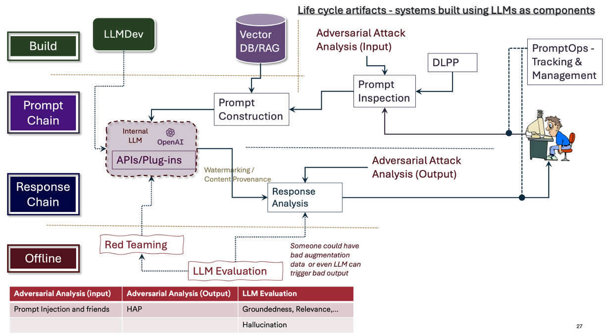
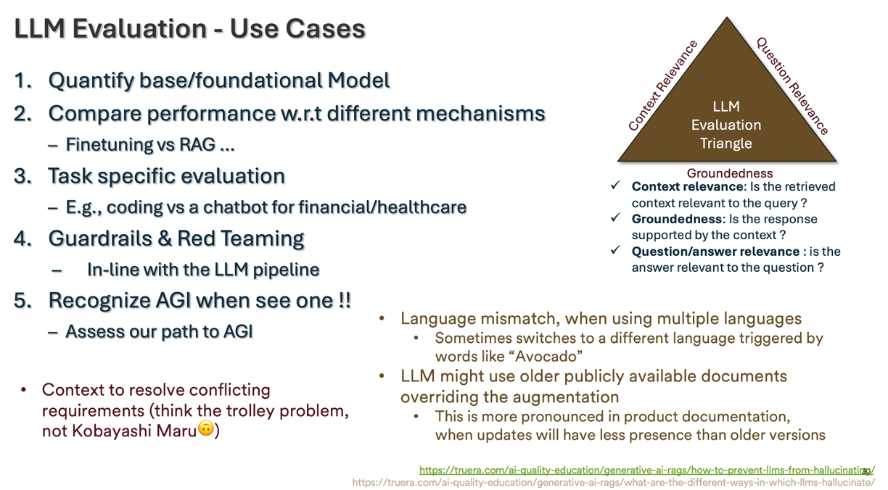

### Awesome-LLM-Eval-MetricMinds : All things for LLM Evaluation
#### _[Back to TOC](https://github.com/xsankar/Awesome-Awesome-LLM)_
> [About Me](https://www.linkedin.com/in/ksankar) [Blog](https://ksankar.medium.com)
***
| [Survey Paper Collection](#survey-papers) | [General Theory](#general-theory) | [Evaluation Experiments](#evaluation-experiments) | [Multi Benchmark Frameworks](#multi-benchmark-frameworks) |[Frameworks & Benchmarks by topic](#frameworks--benchmarks-by-topic) | [Datasets](#datasets) | [Other Repos](#other-repos) |
| :-: | :-: | :-: | :-: |:-: |:-: |:-: |
***
### Some Concepts

***

***

***

***

***
| [Survey Paper Collection](#survey-papers) | [General Theory](#general-theory) | [Evaluation Experiments](#evaluation-experiments) | [Multi Benchmark Frameworks](#multi-benchmark-frameworks) |[Frameworks & Benchmarks by topic](#frameworks--benchmarks-by-topic) | [Datasets](#datasets) | [Other Repos](#other-repos) |
| :-: | :-: | :-: | :-: |:-: |:-: |:-: |
***
## Survey Papers 

| Year | Title | Notes | 
| -: | :- | :- |
| 10.2023 | [Cataloguing LLM Evaluations](https://aiverifyfoundation.sg/downloads/Cataloguing_LLM_Evaluations.pdf) | from [AI verify Foundation SIngapore](https://aiverifyfoundation.sg/) |
| 10.2023 | [Evaluating Large Language Models: A Comprehensive Survey](https://arxiv.org/abs/2310.19736) | |
| 7.2023 | [A Survey on Evaluation of Large Language Models](https://arxiv.org/abs/2307.03109) | |
| 11.2022 | [Holistic Evaluation of Language Models](https://arxiv.org/abs/2211.09110) |  |
***
## General Theory 

| Year | Title | Notes | 
| :-: | :-: | :-: |
|  |  | 
***
## Evaluation Experiments 

| Year | Title | Notes | 
| -: | :- | :- |
| 11.2021 | [A Systematic Investigation of Commonsense Knowledge in Large Language Models](https://arxiv.org/abs/2111.00607) | EMNLP/Dubai 2022 | 
***
## Multi Benchmark Frameworks 

| Year | Title | Notes | 
| :- | :- | :- |
| 2023 | [MosaicML Eval Gauntlet](https://www.mosaicml.com/llm-evaluation) | Good eval framework. Encompasses 34 different benchmarks, organized into 6 broad categories of competency that we expect good foundation models to have. Their categorization is very useful - I am borrowing some of their ideas !|
| 2023 | [OpenCompass](https://github.com/open-compass/opencompass) | Extensive dataset support, good dataset list |
***
## Frameworks & Benchmarks by topic 

---
| [Robustness](#robustness) | [Factuality](#factuality) | [Hallucination](#hallucination) | [Accuracy](#accuracy) | [Bias](#bias) | [Toxicity](#toxicity) | [Dialogue Kinetics](#dialogue-kinetics) |
| :- | :- | :- | :- |:- |:- |:- |
---
| [World Knowledge](#world-knowledge) | [Commonsense Reasoning](#commonsense-reasoning) | [Language Understanding](#language-understanding) | [Symbolic Problem Solving](#symbolic-problem-solving) |[Math QA](#math-qa) | [Reading Comprehension](#reading-comprehension) | [Programming](programming) |
| :- | :- | :- | :- |:- |:- | :- |
***
## Robustness

> Emergent Behavior, Robustness
> 
| Year | Title | Github/Dataset | Notes | 
| :- | :- | :- |:- |
|  | DecodingTrust (Metrics : Adversarial Accuracy, Distributional Shift) |  |
---
## Factuality

> Factuality, Relevance (Context/Question), Coherence, Groundedness, Comprehensiveness
> Dark Patterns e.g., CFPB “Luring Test” a.k.a. Dark Patterns : design strategies used to trick consumers during their purchasing experience and guide them to decisions they would not make otherwise - ranging from manipulation to deception
> 
| Year | Title | Github/Dataset | Notes | 
| :- | :- | :- |:- |
|  | HELM |  |
|  | BigBench |  |
|  | Eleuther Evaluation Harness |  |
|  | Factool |  |
|  |  | TruthfulQA |
---
## Hallucination

> TBD
> 
| Year | Title | Github/Dataset | Notes | 
| :- | :- | :- |:- |
|  |  |  |
---
## Accuracy

> TBD

| Year | Title | Github/Dataset | Notes | 
| :- | :- | :- |:- |
|  |  |  |
---
## Bias

> TBD

| Year | Title | Github/Dataset | Notes | 
| :- | :- | :- |:- |
|  |  |  |
---
## Toxicity

> HAP (Hate,Abuse,P)

| Year | Title | Github/Dataset | Notes | 
| :- | :- | :- |:- |
|  |  |  |
---
## Dialogue Kinetics

> Manner in which an LLM is interacting with the users
> Problematic language generation (toxicity above), Bias (above)
> Tonality, Fluency, Language Mismatch, Verbosity, Egregious Conversation Detector
> 
| Year | Title | Github/Dataset | Notes | 
| :- | :- | :- |:- |
|  |  |  |
---
## World Knowledge 

| Year | Title | Github/Dataset | Notes | 
| :- | :- | :- |:- |
| 2022 | Jeopardy | [Jeopardy Data at Higginface](https://huggingface.co/datasets/jeopardy) | Jeopardy consists of 2,117 Jeopardy questions separated into 5 categories: Literature, American History, World History, Word Origins, and Science. The model is expected to give the exact correct response to the question. (MosaicML has custom curated the larger Jeopardy set available on Huggingface for their evaluation framework)|
| 2022 | BIG-bench: wikidata | [Github Link](https://github.com/google/BIG-bench/tree/main/bigbench/benchmark_tasks/qa_wikidata) | BIG-bench wikidata consists of 20,321 questions regarding factual information pulled from wikipedia. Questions range from the native language of celebrities to the country that different regions belong to. Models are given a sentence such as “The country of citizenship of Barack Obama is” and are expected to complete the sentence with e.g. “the United States.” |
| 2022 | BIG-bench misconceptions | [Github Link](https://github.com/google/BIG-bench/tree/main/bigbench/benchmark_tasks/misconceptions) | Big bench misconceptions consists of 219 true or false questions regarding common misconceptions about a variety of topics including urban legends, stereotypes, basic science, and law |
| 2019 | MMLU (Measuring Massive Multitask Language Understanding) - World Knowledge + Problem Solving Ability | [Paper](https://arxiv.org/abs/2009.03300) | MMLU consists of 14,042 four-choice multiple choice questions distributed across 57 categories. The questions are in the style of academic standardized tests and the model is provided the question and the choices and is expected to choose between A, B, C, and D as its outputs. The subjects range from jurisprudence, to math, to morality |
| 2019 | ARC easy | [Leaderboard & Dataset - Allen Institute for AI](https://leaderboard.allenai.org/arc_easy/submissions/get-started) | ARC easy consists of 2,376 easy four-choice multiple choice science questions drawn from grade 3-9 science exams. The questions rely on world knowledge related to basic science |
| 2018 | ARC challenge | [Leaderboard & Dataset - Allen Institute for AI](https://allenai.org/data/arc) | ARC challenge consists of 1,172 hard four-choice multiple choice science questions drawn from grade 3-9 science exams. The questions rely on scientific world knowledge and some procedural reasoning |
---
## Commonsense Reasoning 

> Commonsense reasoning tests the models’ ability to perform basic reasoning tasks that require commonsense knowledge of objects, their properties, and their behavior.

| Year | Title | Github/Dataset | Notes | 
| :- | :- | :- |:- |
|  |  |  |
---
## Language Understanding

> Language understanding tasks evaluate the model’s ability to understand the structure and properties of languages, including determining which types of sentences are more likely than others, performing translations between languages, and identifying languages.

| Year | Title | Github/Dataset | Notes | 
| :- | :- | :- |:- |
|  |  |  |
---
## Symbolic Problem Solving 

> Symbolic problem solving tasks test the model’s ability to solve a diverse range of symbolic tasks including arithmetic, logical reasoning, algorithms, and algebra.

| Year | Title | Github/Dataset | Notes | 
| :- | :- | :- |:- |
|  |  |  |
---
## Math QA 

| Year | Title | Github/Dataset | Notes | 
| :- | :- | :- |:- |
|  |  |  |
---
## Reading Comprehension 

> Reading comprehension benchmarks test a model’s ability to answer questions based on the information in a passage of text. It includes a number of multiple choice benchmarks as well as some benchmarks that require the model to output an exact correct answer.

| Year | Title | Github/Dataset | Notes | 
| :- | :- | :- |:- |
|  |  |  |
---
## Programming

> Programming tasks evaluate the model's ability to understand code, write functionally correct code given a specification, simulate code, and document code.

| Year | Title | Github/Dataset | Notes | 
| :- | :- | :- | :- |
| 2022 | [Evaluating Large Language Models Trained on Code](https://arxiv.org/abs/2107.03374)  | [Github](https://github.com/openai/human-eval) [Dataset](https://paperswithcode.com/dataset/humaneval) | HumanEval code generation - consists of 164 python programming challenges, in which the model is presented with the method signature and docstring comment for a python program and is expected to complete the program. We then test the resultant code’s functional correctness on a number of test input/output pairs. |
***
## Datasets 

| Year | Title | Notes | 
| :- | :- | :- |
|  | [Jeopardy Data at Higginface](https://huggingface.co/datasets/jeopardy) |  |
***
## Other Repos 

| Repo | Notes | 
| :-: | :-: |
|[Papers and resources for LLMs evaluation](https://github.com/MLGroupJLU/LLM-eval-survey) | Exhaustive list of benchmarks |

 
