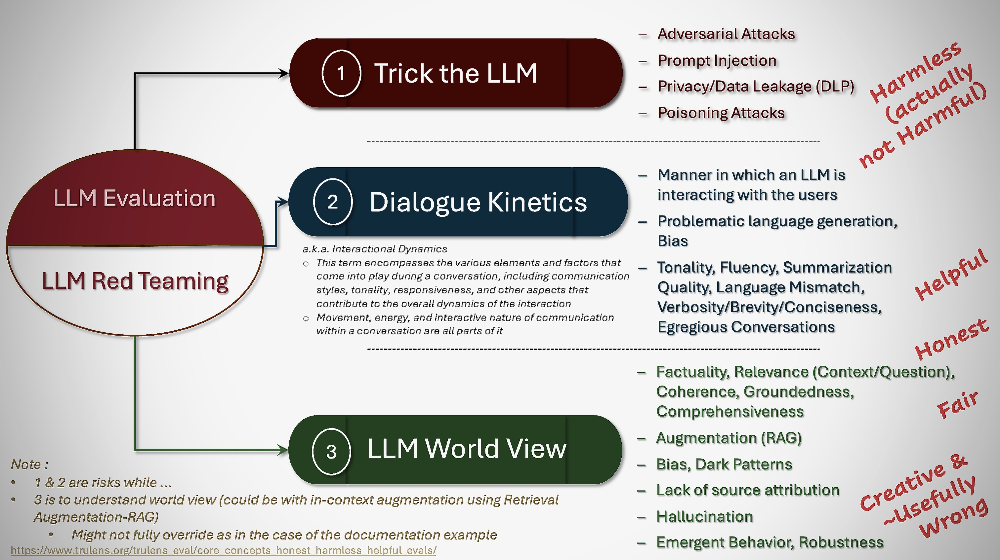

### Awesome-LLM-Eval-MetricMinds : All things for LLM Evaluation
#### _[Back to TOC](https://github.com/xsankar/Awesome-Awesome-LLM)_
> [About Me](https://www.linkedin.com/in/ksankar) [Blog](https://ksankar.medium.com)
> 
> |***As of 11.30.23, I am working hard to build the repos - takes time to review and curate. Appreciate your patience ... Thanks ...***|
> | :- |
> 
---
| [Survey Paper Collection](#survey-papers) | [General Theory](#general-theory) | [Evaluation Experiments](#evaluation-experiments) | [Guardrail Platforms](#guardrail-platforms) | [Multi Benchmark Frameworks](#multi-benchmark-frameworks) |
| :-: | :-: | :-: | :-: |:-: |
---
| [Frameworks & Benchmarks by topic](#frameworks--benchmarks-by-topic) | [Datasets](#datasets) | [Other Repos](#other-repos) | [Data Leakage](#data-leakage)|
| :-: | :-: | :-: | :-: |
***
### Some Concepts

***

***

***

***

***
| [Survey Paper Collection](#survey-papers) | [General Theory](#general-theory) | [Evaluation Experiments](#evaluation-experiments) | [Guardrail Platforms](#guardrail-platforms) | [Multi Benchmark Frameworks](#multi-benchmark-frameworks) |
| :-: | :-: | :-: | :-: |:-: |
***
| [Frameworks & Benchmarks by topic](#frameworks--benchmarks-by-topic) | [Datasets](#datasets) | [Other Repos](#other-repos) | [Data Leakage](#data-leakage)|
| :-: | :-: | :-: | :-: |
***
## Survey Papers 

| Year | Title | Notes | 
| -: | :- | :- |
| 10.2023 | [Cataloguing LLM Evaluations](https://aiverifyfoundation.sg/downloads/Cataloguing_LLM_Evaluations.pdf) | from [AI verify Foundation SIngapore](https://aiverifyfoundation.sg/) |
| 10.2023 | [Evaluating Large Language Models: A Comprehensive Survey](https://arxiv.org/abs/2310.19736) | |
| 7.2023 | [A Survey on Evaluation of Large Language Models](https://arxiv.org/abs/2307.03109) | |
| 11.2022 | [Holistic Evaluation of Language Models](https://arxiv.org/abs/2211.09110) |  |
| 2021 | [A Systematic Investigation of Commonsense Knowledge in Large Language Models](https://arxiv.org/abs/2111.00607) |  |
***
## General Theory 

| Year | Title | Notes | 
| :-: | :-: | :-: |
|  |  | 
***
## Evaluation Experiments 

| Year | Title | Notes | 
| -: | :- | :- |
| 2023 | [DecodingTrust: A Comprehensive Assessment of Trustworthiness in GPT Models](https://arxiv.org/abs/2306.11698) | |
| 11.2021 | [A Systematic Investigation of Commonsense Knowledge in Large Language Models](https://arxiv.org/abs/2111.00607) | EMNLP/Dubai 2022 | 
***
## Guardrail Platforms

| Type | Title | Notes | 
| -: | :- | :- |
| Evaluation Guardrail | [Trulens](https://www.trulens.org/) | By TruEra. Truthfulness, Question answering relevance, Harmful or toxic language, User sentiment, Language mismatch, Response verbosity, LLM Augmentation | 
| Prompt Injection | [Rebuff](https://guthub.com/protectai/rebuff) | By Protect AI. Open source – self hardening prompt injection detector | 
| PII Scrubber | [LLM Gateway](https://github.com/wealthsimple/llm-gateway) | Tracks data sent and received from these providers in a postgres database and runs PII scrubbing heuristics prior to sending | 
| PII Scrubber | [Azure Presidio](https://microsoft.github.io/presidio/) | Micro$oft | 
| Guardrails.ai | [Guardrail](https://github.com/guardrails-ai/guardrails)| [Nvidia nemo + Guardrails](https://arize.com/blog-course/guardrails-what-are-they-and-how-can-you-use-nemo-and-guardrails-ai-to-safeguard-llms/) | 
| Guardrail | [Nvidia Nemo Framework](https://developer.nvidia.com/nemo) | Monitoring communication in both directions, Topical guardrails, Safety guardrails (response), Security guardrails (malicious code) |
| Guardrail for aws bedrock | [Bedrock Guardrails](https://aws.amazon.com/bedrock/guardrails/) | |
***
## Multi Benchmark Evaluation Frameworks 

>
| Year | Title | Notes | 
| :- | :- | :- |
| 2023 | [MosaicML Eval Gauntlet](https://www.mosaicml.com/llm-evaluation) | Good eval framework. Encompasses 34 different benchmarks, organized into 6 broad categories of competency that we expect good foundation models to have. Their categorization is very useful - I am borrowing some of their ideas !|
| 2023 | [OpenCompass](https://github.com/open-compass/opencompass) | Extensive dataset support, good dataset list |
| 2023 | [GAIA: a benchmark for General AI Assistants](https://huggingface.co/papers/2311.12983) | Hugginface questions
| | [Language Model Evaluation Harness - EleutherAI](https://github.com/EleutherAI/lm-evaluation-harnes) | 200+ subtasks / evaluation settings implemented |
| | [Alpaca Eval](https://github.com/tatsu-lab/alpaca_eval) | An Automatic Evaluator for Instruction-following Language Models |
| 11.2023| [IFEval](https://arxiv.org/abs/2311.07911) | 25 types of verifiable instructions and constructed around 500 prompts |
| | [Giskard](https://huggingface.co/blog/JMJM/giskard-llm-testing-and-debugging-hf) | Multiple vulnerabilities |
***
## Frameworks & Benchmarks by topic 

---
| [Dialogue Kinetics](#dialogue-kinetics) | [Bias](#bias) | [Toxicity](#toxicity) | [Robustness](#robustness) | [Factuality](#factuality) | [Hallucination](#hallucination) | [Accuracy](#accuracy) | [Alignment](#alignment) |
| :- | :- | :- | :- |:- |:- |:- | :- |
---
| [World Knowledge](#world-knowledge) | [Commonsense Reasoning](#commonsense-reasoning) | [Language Understanding](#language-understanding) | [Symbolic Problem Solving](#symbolic-problem-solving) | [Reading Comprehension](#reading-comprehension) | [Programming](programming) |
| :- | :- | :- | :- |:- |:- |
***

***

***
## Dialogue Kinetics

> Manner in which an LLM is interacting with the users
> > a.k.a. _Interactional Dynamics_ - This term encompasses the various elements and factors that come into play during a conversation, including communication styles, tonality, responsiveness, and other aspects that contribute to the overall dynamics of the interaction.
> > Movement, energy, and interactive nature of communication within a conversation.
> 
> Problematic language generation (toxicity below), Bias (below)
> 
> Tonality, Fluency, Language Mismatch, Verbosity, Egregious Conversation Detector
> 
| Year | Title | Github/Dataset | Notes | 
| :- | :- | :- |:- |
|  |  |  |
---
## Bias

> Evaluation frameworks and datasets for different types of bias

| Type | Year | Title | Github/Dataset | Notes | 
| :- | :- | :- | :- |:- |
| Stereotype Bias |  | HELM (Holistic Evaluation of Language Models) | Dataset - Bias Benchmark for Question Answering (BBQ) |  |
| Stereotype Bias |  | [BigBench](https://crfm.stanford.edu/helm/latest/) | Dataset - Bias Benchmark for Question Answering (BBQ) |  |
| Fairness |  | DecodingTrust | Dataset - UCI Adult dataset [Ding et al., 2021](https://arxiv.org/abs/2108.04884) | (Metrics : Demographic Parity, Equalized Odds, Treatment Equality, Individual/Group Fairness) |
| Representation of Subjective Opinions |  | Set out in Durmus et al. (2023) arXiv:2306.16388 | GlobalOpinionQA |  |
| Capability Fairness |  | HELM | Dataset-TwitterAAE |  |
| Fairness | | Jurity | open source fairness testing package maintained by Fidelity Investments |
---
## Toxicity

> HAP (Hate,Abuse,Profanity)

| Type | Year | Title | Github/Dataset | Notes | 
| :- | :- | :- | :- |:- |
| Toxicity Generation |  | HELM | Data - RealToxicityPrompts | Scoring method: Model scoring with Perspective API |
| Toxicity Generation |  | DecodingTrust | Data - RealToxicityPrompts | Scoring method: Model scoring with Perspective API |
| Toxicity Score |  | BLEU framework | [Hugging Face based Toxicity Score](https://huggingface.co/spaces/evaluate-measurement/toxicity) | (Metrics : BLEU Score, WER) |
---
## Robustness

> Emergent Behavior, Robustness
> 
| Year | Title | Github/Dataset | Notes | 
| :- | :- | :- |:- |
|  | DecodingTrust (Metrics : Adversarial Accuracy, Distributional Shift) |  |
---
## Factuality

> Factuality, Relevance (Context/Question), Coherence, Groundedness, Comprehensiveness
> Dark Patterns _e.g., CFPB “Luring Test” a.k.a. Dark Patterns : design strategies used to trick consumers during their purchasing experience and guide them to decisions they would not make otherwise - ranging from manipulation to deception_
> 
| Year | Title | Github/Dataset | Notes | 
| :- | :- | :- |:- |
|  | HELM |  | |
|  | BigBench |  | |
|  | Eleuther Evaluation Harness |  | |
|  | Factool - Factuality Detection & Verification Framework | [GitHub](https://github.com/GAIR-NLP/factool) | Open Source – Fact Checker Meta/CMU |
|  |  | TruthfulQA | |
---
## Hallucination

> TBD
> 
| Year | Title | Github/Dataset | Notes | 
| :- | :- | :- |:- |
|  | Hallucination Evaluation Model | Vectara [Hugginface](https://huggingface.co/vectara/hallucination_evaluation_model), [Leaderboard](https://github.com/vectara/hallucination-leaderboard) | Hallucination Evaluation Model - evaluates how often an LLM introduces hallucinations when summarizing a document |
| | Generative Assessment Project | [Project Site - Arthur.ai](https://www.arthur.ai/gap) | [Interesting dataset - Databricks Dolly 15K](https://huggingface.co/datasets/databricks/databricks-dolly-15k)|
---
## Accuracy

> TBD
>
| Year | Title | Github/Dataset | Notes | 
| :- | :- | :- |:- |
|  |  |  | Metrics : Perplexity, Entropy, BPC |
---
## Alignment

> TBD
>
| Year | Title | Github/Dataset | Notes | 
| :- | :- | :- |:- |
| 2023 | [FLASK: Fine-grained Language Model Evaluation based on Alignment Skill Sets](https://arxiv.org/abs/2307.10928) | [GitHub](https://github.com/kaistAI/FLASK) |  |
---
## World Knowledge 

| Year | Title | Github/Dataset | Notes | 
| :- | :- | :- |:- |
| 2022 | Jeopardy | [Jeopardy Data at Higginface](https://huggingface.co/datasets/jeopardy) | Jeopardy consists of 2,117 Jeopardy questions separated into 5 categories: Literature, American History, World History, Word Origins, and Science. The model is expected to give the exact correct response to the question. (MosaicML has custom curated the larger Jeopardy set available on Huggingface for their evaluation framework)|
| 2022 | BIG-bench: wikidata | [Github Link](https://github.com/google/BIG-bench/tree/main/bigbench/benchmark_tasks/qa_wikidata) | BIG-bench wikidata consists of 20,321 questions regarding factual information pulled from wikipedia. Questions range from the native language of celebrities to the country that different regions belong to. Models are given a sentence such as “The country of citizenship of Barack Obama is” and are expected to complete the sentence with e.g. “the United States.” |
| 2022 | BIG-bench misconceptions | [Github Link](https://github.com/google/BIG-bench/tree/main/bigbench/benchmark_tasks/misconceptions) | Big bench misconceptions consists of 219 true or false questions regarding common misconceptions about a variety of topics including urban legends, stereotypes, basic science, and law |
| 2019 | MMLU (Measuring Massive Multitask Language Understanding) - World Knowledge + Problem Solving Ability | [Paper](https://arxiv.org/abs/2009.03300) | MMLU consists of 14,042 four-choice multiple choice questions distributed across 57 categories. The questions are in the style of academic standardized tests and the model is provided the question and the choices and is expected to choose between A, B, C, and D as its outputs. The subjects range from jurisprudence, to math, to morality |
| 2019 | ARC easy | [Leaderboard & Dataset - Allen Institute for AI](https://leaderboard.allenai.org/arc_easy/submissions/get-started) | ARC easy consists of 2,376 easy four-choice multiple choice science questions drawn from grade 3-9 science exams. The questions rely on world knowledge related to basic science |
| 2018 | ARC challenge | [Leaderboard & Dataset - Allen Institute for AI](https://allenai.org/data/arc) | ARC challenge consists of 1,172 hard four-choice multiple choice science questions drawn from grade 3-9 science exams. The questions rely on scientific world knowledge and some procedural reasoning |
---
## Commonsense Reasoning 

> Commonsense reasoning tests the models’ ability to perform basic reasoning tasks that require commonsense knowledge of objects, their properties, and their behavior.
> 
| Year | Title | Github/Dataset | Notes | 
| :- | :- | :- |:- |
| 2011 | [The Winograd Schema Challenge](https://commonsensereasoning.org/2011/papers/Levesque.pdf) |  | The original Winograd Schema Challenge - 273 scenarios in which the model must use semantics to correctly resolve the anaphora in a sentence. Random baseline accuracy: 50% |
| 2022 | [The Defeat of the Winograd Schema Challenge](https://arxiv.org/abs/2201.02387) | | |
| 2019 | [WinoGrande: An Adversarial Winograd Schema Challenge at Scale](https://arxiv.org/abs/1907.10641) | [Dataset and Code](https://winogrande.allenai.org/) | Examines physical and social common sense. A large-scale dataset of 44k problems, inspired by the original WSC design, but adjusted to improve both the scale and the hardness of the dataset. Random baseline accuracy: 50%|
| 2023 | LogicGLUE | | [Towards LogiGLUE: A Brief Survey and A Benchmark for Analyzing Logical Reasoning Capabilities of Language Models](https://arxiv.org/abs/2310.00836v2) |
| 2022 | BIG-bench: Strategy QA | | BIG-bench strategy QA consists of 2,289 very eclectic yes/no questions on a wide range of commonsense subjec e.g “Can fish get Tonsilitis?” |
| 2022 | BIG-bench: Strange Stories | | BIG-bench strange stories consists of 174 short stories followed by a two-choice multiply choice question in which the model is asked to make commonsense inferences about the characters in the stories, how they might feel, and why they act in certain ways. Random baseline accuracy: 50% |
| 2022 | BIG-bench: Novel Concepts | | BIG-bench novel concepts consists or 32 find-the-common-concept problems in which the model is given 3 words and has to choose from among 4 possible concepts that they all have in common. Random baseline accuracy: 25% |
| 2019 | [SocialIQA: Commonsense Reasoning about Social Interactions](https://arxiv.org/abs/1904.09728) |  | Evaluates social common sense |
| 2019 | [PIQA: Reasoning about Physical Commonsense in Natural Language](https://arxiv.org/abs/1911.11641) | | Covers the physical aspect of common sense. PIQA consists of 1,838 commonsense physical intuition 2-choice multiple choice questions. Random baseline accuracy: 50%|
| 2019 | HellaSwag | [HellaSwag: Can a Machine Really Finish Your Sentence?](https://arxiv.org/abs/1905.07830) | Evaluate physical, grounded, and temporal common sense. HellaSwag consists of 10,042 multiple choice scenarios in which the model is prompted with a scenario and choose the most likely conclusion to the scenario from four possible options. Random baseline accuracy: 25%  |
| 2018 | OpenBook QA |  | OpenBook QA consists of 500 four-choice multiple choice questions that rely on basic physical and scientific intuition about common objects and entities. Random baseline accuracy: 25% |
| 2011 | COPA | | COPA consists of 100 cause/effect multiple choice questions in which the model is prompted with a premise and the model must choose correctly between two possible causes/effects of the premise. Random baseline accuracy: 50% |
---
## Language Understanding

> Language understanding tasks evaluate the model’s ability to understand the structure and properties of languages, including determining which types of sentences are more likely than others, performing translations between languages, and identifying languages.
> 
| Year | Title | Github/Dataset | Notes | 
| :- | :- | :- |:- |
| 2022 | BIG bench conceptual combinations |  | BIG bench conceptual combinations consists of 103 four-choice multiple choice questions in which the model is presented with a made up word and its definition along with a multiple choice question regarding the meaning of a sentence using that made up word. The model is then expected to select the correct answer among the choices presented.Random baseline accuracy: 25%|
| 2022 | BIG bench conlang translation |  | BIG bench conlang translation consists of 164 example problems in which the model is given translations of simple sentences between English and some fake constructed language. The model is then tested for its ability to translate a complex sentence in the fake language into English.|
| 2016 | LAMBADA |  | LAMBADA consists of 5,153 passages take from books. The model is expected to read the first N-1 words of each passage and predict the final token.|
| 2012 | BIG bench language identification |  | BIG bench language identification consists of 10,000 four-choice multiple choice questions in which a sentence in some language besides english is presented and the model is prompted to identify the language of the sentence amongst four options. Random baseline accuracy: 25% |
---
## Symbolic Problem Solving 

> Symbolic problem solving tasks test the model’s ability to solve a diverse range of symbolic tasks including arithmetic, logical reasoning, algorithms, and algebra.
>
| Year | Title | Github/Dataset | Notes | 
| :- | :- | :- |:- |
| 2023 | Simple arithmetic with spaces |  | Simple arithmetic with spaces was developed by MosaicML. It consists of 1000 arithmetic problems consisting of up to 3 operations and using numbers of up to 3 digits. There is spacing between all numbers and operators. The model is expected to calculate the correct result of the expression using the appropriate order of operations|
| 2023 | Simple arithmetic without spaces |  | Simple arithmetic without spaces was developed by MosaicML. It consists of 1000 arithmetic problems consisting of up to 3 operations and using numbers of up to 3 digits. There is no spacing between any of the numbers and operators. The model is expected to calculate the correct result of the expression using the appropriate order of operations.|
| 2022 | BIG-bench elementary math QA |  | Big bench elementary math QA consists of 38,160 four-choice multiple choice arithmetic word problems.Random baseline accuracy: 25%|
| 2022 | BIG-bench dyck languages |  | Big bench dyck languages consists of 1000 complete-the-sequence questions, in which a partially completed balanced expression consisting of parentheses and braces is given, and the model needs to output the exact tokens necessary in order to complete the balanced expression.|
| 2022 | BIG-bench  algorithms |  | Big bench cs algorithms consists of 1,320 samples of questions falling into one of two types. In the first type the model must determine the length of the longest common subsequence of two strings, and in the second type the model must determine whether an expression consisting of parentheses and braces is balanced.|
| 2022 | BIG-bench logical deduction |  | Big bench logical deduction consists of 1500 four-choice multiple choice questions, in which the model is posed with a number of logical constraints describing the relative ordering of some number of objects. The model must then choose from among a list of four statements, which statement is the only one that is logically consistent with the constraints posed.Random baseline accuracy: 25%|
| 2022 | BIG-bench operators |  | Big bench logical operators consists of 210 questions, in which a number of mathematical operators are defined and the model is expected to calculate the result of some expression consisting of those defined operators. This tests the model’s ability to handle mathematical abstractions and apply them appropriately.|
| 2022 | BIG-bench repeat copy logic |  | Big bench repeat copy logic consists of 32 tasks in which the model is commanded to repeat some combination of words some number of times in a particular order, and the model is expected to output the correct result.|
| 2021 | Math QA |  | Math QA consists of 2,983 four-choice multiple choice math word problems. The questions require basic reasoning, language comprehension, and arithmetic/algebraic skills.Random baseline accuracy: 25%|
| 2021 | LogiQA |  | LogiQA consists of 651 four-choice multiple choice logical word problems.The questions involve making logical deductions based on mathematical and symbolic descriptions of problems.Random baseline accuracy: 25% |
---
## Reading Comprehension 

> Reading comprehension benchmarks test a model’s ability to answer questions based on the information in a passage of text. It includes a number of multiple choice benchmarks as well as some benchmarks that require the model to output an exact correct answer.

| Year | Title | Github/Dataset | Notes | 
| :- | :- | :- |:- |
| 2022 | BIG-bench: Understanding fables |  | Understanding fables consists of 189 short stories followed by 4-choice multiple choice in which the model must select the correct moral for the story.Random baseline accuracy: 25% |
| 2019 | Pubmed QA Labeled |  | Pubmed QA Labeled consists of 1000 hand-labeled medical documents followed by a related question for which the model must respond yes/no/maybe. |
| 2019 | BoolQ |  | ‍BoolQ consists of 3,270 short passages on a diverse range of subjects followed by a yes/no questions. The model is expected to answer in multiple-choice format. 5153 samples of text curated from the books corpus. Consists of a several hundred word paragraph in which the model is expected to predict the next word. Random baseline accuracy: ~50% |
| 2016 | SQuAD |  | SQuAD consists of 10,570 short documents followed by a related question. The documents range from short news clippings about sports events, to blurbs explaining concepts in physics, to documents about US history. We expect the model to output the exact correct answer. |
---
## Programming

> Programming tasks evaluate the model's ability to understand code, write functionally correct code given a specification, simulate code, and document code.

| Year | Title | Github/Dataset | Notes | 
| :- | :- | :- | :- |
| 2022 | [Evaluating Large Language Models Trained on Code](https://arxiv.org/abs/2107.03374)  | [Github](https://github.com/openai/human-eval) [Dataset](https://paperswithcode.com/dataset/humaneval) | HumanEval code generation - consists of 164 python programming challenges, in which the model is presented with the method signature and docstring comment for a python program and is expected to complete the program. We then test the resultant code’s functional correctness on a number of test input/output pairs. |
***
## Datasets 

| Year | Title | Notes | 
| :- | :- | :- |
|  | [Jeopardy Data at Higginface](https://huggingface.co/datasets/jeopardy) |  |
***
## Other Repos 

| Repo | Notes | 
| :- | :- |
|[Papers and resources for LLMs evaluation](https://github.com/MLGroupJLU/LLM-eval-survey) | Exhaustive list of benchmarks |
| https://github.com/tjunlp-lab/Awesome-LLMs-Evaluation-Papers | |
| https://github.com/onejune2018/Awesome-LLM-Eval | |
***
## Data Leakage 

>
| Type | Year | Title | Notes | 
| :- | :- | :- | :- |
| Training data leakage | 2023 | [ChatGPT Can Reveal Personal Information From Real People, Google Researchers Show](https://www.vice.com/en/article/88xe75/chatgpt-can-reveal-personal-information-from-real-people-google-researchers-show) |  |
| Training data leakage | 2023 | [LLMs do not disclose training dataset; Nonetheless, Enron Email is a good bet (Wang et al. (2023)](arXiv:2306.11698) | May be common crawl or Pile |
| Personal Data |  | DecodingTrust | Enron Email Dataset created by Huang at al. (2022) arXiv:2205.12628v2 |
| Non-personal data | | HELM | Pre-processed dataset in HELM (E.4 of Liang et al. (2022)) arXiv:2211.09110 |
***
 
